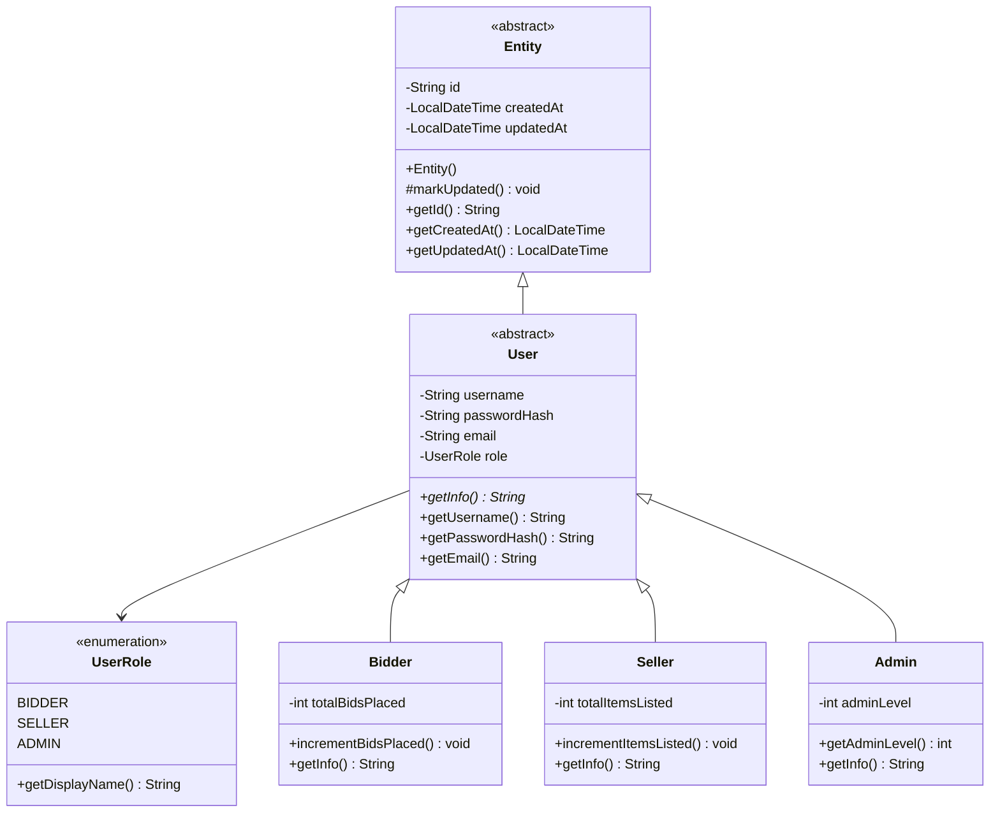
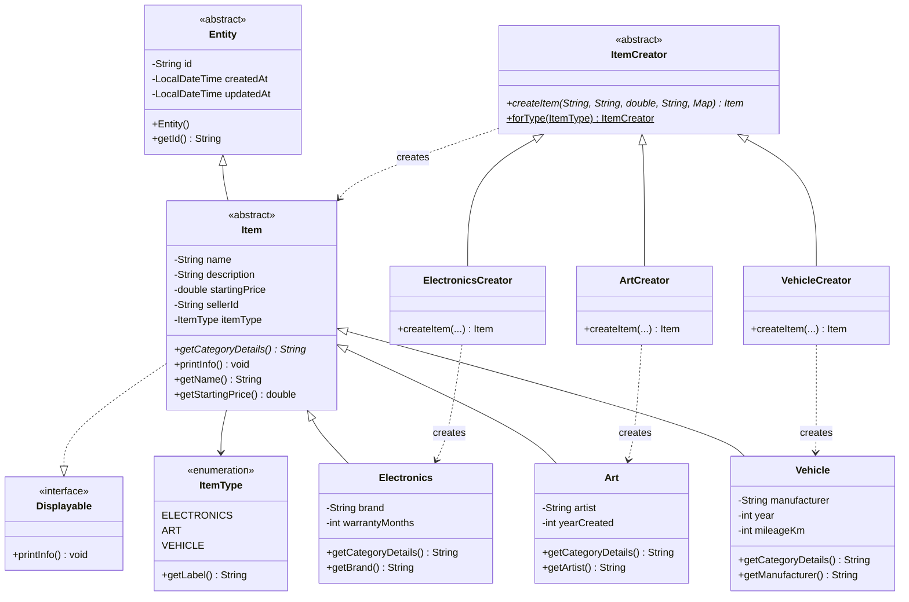
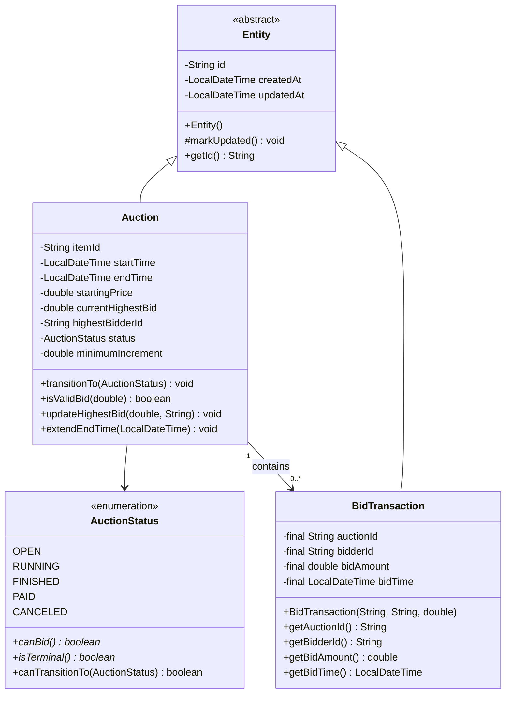

# BidHub — Báo cáo Tiến độ 2 Tuần Đầu

> **Dự án:** Hệ thống đấu giá trực tuyến BidHub
> **Nhóm:** Đăng · Quốc Minh · Công Minh · Khoa
> **Công nghệ:** Java 21 · JavaFX · Maven · JUnit 5 · GitHub Actions
> **Ngày báo cáo:** 19/04/2026

---

## 1. Nhóm đang có gì sau 2 tuần?

Sau 2 tuần, BidHub đã có một **nền móng kỹ thuật hoàn chỉnh** — từ hạ tầng CI/CD cho đến toàn bộ bộ xương domain model. Đây là snapshot hiện tại:

```
BidHub/
├── bidhub-common/          ← Class dùng chung: Entity, User, Item, Exception
├── bidhub-server/          ← Logic nghiệp vụ: Auction, BidTransaction
└── bidhub-client/          ← Giao diện JavaFX: LoginView đang chạy được
```

| Hạng mục | Trạng thái |
|----------|-----------|
| Maven multi-module build | ✅ `mvn compile` xanh cả 3 module |
| CI/CD GitHub Actions | ✅ Badge xanh — auto-test mỗi lần push |
| JavaFX LoginView | ✅ Cửa sổ chạy được, validation real-time |
| OOP Domain Model | ✅ Entity → User/Item → 6 concrete class |
| Factory Method Pattern | ✅ 4 thành phần GoF đầy đủ |
| Auction State Machine | ✅ 5 trạng thái, abstract method trên enum |
| Exception Hierarchy | ✅ 7 subclass, errorCode chuẩn |
| Test coverage | ✅ **≥ 40 test cases**, 0 failures, 0 errors |

---

## 2. Tuần 1 — Thiết lập hạ tầng (06/04 – 12/04)

> **Triết lý tuần này:** Không code nhiều tính năng. Thiết lập đúng một lần, không mất thời gian sửa về sau.

---

### 👤 Đăng — Maven Multi-Module + ConfigLoader

**Làm gì:**
- Khởi tạo toàn bộ cấu trúc Maven multi-module với `pom.xml` cha-con
- Tạo `ConfigLoader` — utility class đọc file `.properties` từ classpath

**Tại sao chọn Maven multi-module thay vì 1 module duy nhất?**

Dự án BidHub có 3 thành phần độc lập: `bidhub-server`, `bidhub-client`, và `bidhub-common`. Nếu để trong 1 module, JavaFX (chỉ cần ở client) sẽ bị bundle vào cả server — thừa dependency, tăng rủi ro conflict. Tách module đảm bảo: **mỗi module chỉ biết những gì nó cần**, server không biết JavaFX tồn tại.

```
Parent POM (bidhub-parent)
├── <dependencyManagement>  ← Khai báo version 1 chỗ duy nhất
│   ├── JUnit 5 → 5.10.2
│   ├── Jackson → 2.17.0
│   └── SQLite JDBC → 3.45.1
├── bidhub-common/pom.xml  ← KHÔNG có sqlite, KHÔNG có javafx
├── bidhub-server/pom.xml  ← Có sqlite, import common
└── bidhub-client/pom.xml  ← Có javafx, import common
```

**Tại sao `ConfigLoader` dùng `getResourceAsStream` thay vì `new File()`?**

Khi đóng gói thành JAR, đường dẫn file hệ thống không còn hợp lệ. `getResourceAsStream` đọc thẳng từ classpath — chạy được cả khi là JAR lẫn khi debug trong IDE. Constructor `private` và class `final` đảm bảo không ai `new ConfigLoader()` — đây là **Utility class pattern**.

---

### 👤 Quốc Minh — CI/CD GitHub Actions + API Protocol Doc

**Làm gì:**
- Thiết lập GitHub Actions pipeline: tự động chạy `mvn test` mỗi khi push
- Viết `API_PROTOCOL.md` — định nghĩa format JSON chuẩn cho giao tiếp Client↔Server

**Tại sao cần CI/CD ngay từ tuần 1?**

Dự án 4 người, 4 branch song song. Nếu không có CI, merge conflict và broken test có thể ở ẩn hàng ngày mà không ai biết. GitHub Actions giải quyết bằng cách **tự động chặn merge** khi test fail:

```yaml
# .github/workflows/ci.yml
on: [push, pull_request]     # Trigger mỗi khi push hoặc tạo PR
jobs:
  build:
    runs-on: ubuntu-latest
    steps:
      - uses: actions/setup-java@v4
        with: { java-version: '21' }
      - run: mvn test          # Full test suite phải xanh
```

Cache `~/.m2` giúp lần chạy thứ 2 trở đi nhanh hơn ~70% — không cần download lại toàn bộ dependency.

**Tại sao viết `API_PROTOCOL.md` trước khi code Socket?**

Contract-first design: xác định format JSON request/response ngay từ đầu. Khi tuần 4 Công Minh code client và Đăng code server cùng lúc, cả hai đều lấy file này làm "hợp đồng" — không cần chờ nhau để biết format dữ liệu.

---

### 👤 Công Minh — JavaFX MVC Skeleton + LoginView

**Làm gì:**
- Tạo ứng dụng JavaFX với `LoginView.fxml` — màn hình đăng nhập đầy đủ
- Thiết lập MVC: FXML (View) + `LoginController.java` (Controller) tách biệt hoàn toàn

**Tại sao dùng FXML thay vì tạo UI bằng Java code thuần?**

Java code thuần trộn logic và layout vào nhau — đọc khó, sửa khó. FXML tách rõ:

```
LoginView.fxml       ← Layout XML, mở được bằng Scene Builder
LoginController.java ← Logic xử lý: validate, hiện lỗi, navigate
```

`@FXML` annotation tự động inject field từ FXML vào Controller khi `FXMLLoader.load()` chạy. `initialize()` được gọi sau khi inject xong — dùng để gắn listener và setup initial state.

**Validation real-time đã có ngay tuần 1:**
- Button "Đăng nhập" disabled khi username hoặc password rỗng
- Nhập username < 3 ký tự → label lỗi màu đỏ hiện ngay, không cần click

---

### 👤 Khoa — JUnit 5 + Testing Convention + Style Guide

**Làm gì:**
- Kích hoạt JUnit 5, viết 15+ test cases với cấu trúc AAA
- Soạn `STYLE_GUIDE.md` theo Google Java Style Guide cho cả nhóm

**Tại sao dùng cấu trúc AAA (Arrange – Act – Assert)?**

AAA là convention giúp ai đọc test cũng hiểu ngay "chuẩn bị gì → làm gì → kỳ vọng gì". Ví dụ:

```java
@Test
@DisplayName("Chia cho 0 phải ném ArithmeticException")
void testDivide_ByZero_ThrowsArithmeticException() {
    // Arrange
    Calculator calc = new Calculator();
    // Act & Assert
    assertThrows(ArithmeticException.class, () -> calc.divide(10, 0));
}
```

**Tại sao `STYLE_GUIDE.md` quan trọng ngay tuần 1?**

4 người code 4 style khác nhau → review mất thời gian tranh luận format. Style Guide chuẩn hóa ngay từ đầu: naming convention (`camelCase` field, `PascalCase` class), Javadoc bắt buộc trên public method, cấm magic number. Tuần 2 trở đi không ai phải comment "đặt tên lại đi".

---

### ✅ Kết quả tuần 1

```
mvn compile → SUCCESS (3 module)
mvn test    → 15 tests passed, 0 failures
CI/CD badge → ✅ xanh trên GitHub
JavaFX      → LoginView hiển thị, validation hoạt động
```

---

## 3. Tuần 2 — OOP Domain Model & Exception Hierarchy (13/04 – 18/04)

> **Tuần cốt lõi nhất:** Xây dựng bộ xương domain mà tất cả các tuần sau đều kế thừa và phụ thuộc.

---

### 3.1 Entity & User Hierarchy — Đăng

**Làm gì:** Tạo module `bidhub-common`, xây dựng cây kế thừa `Entity → User (abstract) → Bidder / Seller / Admin`

#### Tại sao Entity là `abstract class` thay vì `interface`?

`Entity` cần lưu **trạng thái** (`id`, `createdAt`, `updatedAt`) và cần **constructor** để khởi tạo chúng. Interface không có field instance và không có constructor — không thể đóng gói state. Abstract class phù hợp vì:

- Có field `private` → đảm bảo **Encapsulation**
- Có constructor → mọi subclass bắt buộc gọi `super()` để khởi tạo đúng
- Method `protected final markUpdated()` → subclass gọi được nhưng không override được

#### Tại sao dùng UUID thay vì `int` auto-increment?

`int` auto-increment phụ thuộc vào database — tạo object trong memory chưa có id. UUID được tạo ngay trong constructor, không cần database. Khi tuần 3 làm DAO, object đã có id trước khi INSERT vào SQLite.



#### 4 trụ cột OOP — thể hiện cụ thể ở đâu?

| Trụ cột | Thể hiện trong code |
|---------|-------------------|
| **Encapsulation** | Mọi field `private`, chỉ truy cập qua `getter`. `passwordHash` không có setter — không ai đổi password ngoài luồng chính thức |
| **Abstraction** | `Entity` và `User` đều `abstract` — không thể `new Entity()` hay `new User()` trực tiếp. Che giấu chi tiết id/timestamp với người dùng |
| **Inheritance** | `Bidder extends User extends Entity` — 2 tầng kế thừa. `Bidder` có thêm `totalBidsPlaced` riêng |
| **Polymorphism** | `getInfo()` là abstract method trên `User`. Gọi trên `List<User>` → mỗi subclass trả chuỗi khác nhau, không cần `instanceof` |

---

### 3.2 Item Hierarchy & Factory Method Pattern — Quốc Minh

**Làm gì:** Xây cây `Entity → Item (abstract) → Electronics / Art / Vehicle`, áp dụng Factory Method Pattern chuẩn GoF

#### Tại sao cần Factory Method Pattern? Không dùng `new Electronics(...)` thẳng?

Ban đầu nhóm dùng Static Factory:

```java
// Cách cũ — vi phạm Open/Closed Principle
class ItemFactory {
    static Item create(ItemType type, ...) {
        if (type == ELECTRONICS) return new Electronics(...);
        if (type == ART) return new Art(...);
        // Thêm JEWELRY → phải sửa file này
    }
}
```

Vấn đề: mỗi lần thêm loại Item mới, phải **sửa `ItemFactory.java` đang hoạt động tốt** — vi phạm **Open/Closed Principle** (mở để mở rộng, đóng để sửa đổi). Nhóm refactor sang Factory Method Pattern:

```java
// Cách mới — Creator hierarchy
abstract class ItemCreator {
    abstract Item createItem(String name, String desc, double price,
                             String sellerId, Map<String, String> extras);
    static ItemCreator forType(ItemType type) { ... } // Static helper, không phải pattern
}

final class ElectronicsCreator extends ItemCreator { ... }
final class ArtCreator extends ItemCreator { ... }
final class VehicleCreator extends ItemCreator { ... }
```

Thêm `JEWELRY` → chỉ cần tạo `Jewelry.java` và `JewelryCreator.java`. **Không sửa bất kỳ file nào đang có.**



#### 4 thành phần Factory Method Pattern — ánh xạ vào BidHub

| Vai trò GoF | Class trong BidHub | Vai trò cụ thể |
|-------------|-------------------|---------------|
| **Creator** (abstract) | `ItemCreator` | Định nghĩa interface `createItem()` |
| **ConcreteCreator** | `ElectronicsCreator`, `ArtCreator`, `VehicleCreator` | Implement cụ thể từng loại |
| **Product** (abstract) | `Item` | Định nghĩa interface sản phẩm |
| **ConcreteProduct** | `Electronics`, `Art`, `Vehicle` | Object thực sự được tạo ra |

#### Kế thừa 2 tầng và Polymorphism qua Interface

`Item extends Entity` → `item instanceof Entity` là `true`. Item còn `implements Displayable` — đây là cách Java cho phép một class vừa kế thừa abstract class vừa implement interface. Gọi `printInfo()` trên `List<Item>` → mỗi loại tự render thông tin riêng.

---

### 3.3 Auction, State Machine & BidTransaction — Công Minh

**Làm gì:** Xây dựng `Auction` với vòng đời trạng thái, `AuctionStatus` enum có abstract method, `BidTransaction` bất biến hoàn toàn

#### Tại sao dùng Enum với abstract method thay vì if-else?

Cách if-else thông thường:

```java
// Cách cũ — if-else phải kiểm tra mỗi nơi
if (status == RUNNING) {
    // cho phép đặt giá
} else {
    // không cho
}
```

Vấn đề: logic phân tán khắp nơi, mỗi lần thêm state mới phải tìm hết toàn bộ code. `AuctionStatus` enum với abstract method đưa behavior **vào ngay trong từng constant**:

```java
enum AuctionStatus {
    OPEN {
        @Override public boolean canBid() { return false; }
        @Override public boolean isTerminal() { return false; }
    },
    RUNNING {
        @Override public boolean canBid() { return true; }  // ← Duy nhất được đặt giá
        @Override public boolean isTerminal() { return false; }
    },
    FINISHED {
        @Override public boolean canBid() { return false; }
        @Override public boolean isTerminal() { return true; }
    },
    PAID {
        @Override public boolean canBid() { return false; }
        @Override public boolean isTerminal() { return true; }
    },
    CANCELED {
        @Override public boolean canBid() { return false; }
        @Override public boolean isTerminal() { return true; }
    };

    public abstract boolean canBid();
    public abstract boolean isTerminal();
}
```

Mỗi constant tự biết hành vi của mình — **không có if-else, không có switch-case rải rác**.



**Vòng đời trạng thái — chỉ đi 1 chiều, không quay lui:**

```
OPEN → RUNNING → FINISHED → PAID
                          ↘ CANCELED
    
```

`transitionTo()` dùng `canTransitionTo()` để validate — chuyển trạng thái sai (ví dụ `FINISHED → OPEN`) ném `IllegalStateException` ngay lập tức, không để state corrupt.

#### Tại sao BidTransaction bất biến (immutable)?

Mỗi `BidTransaction` là **bằng chứng lịch sử** — một lần đặt giá không thể bị sửa. Tất cả field đều `final`, không có setter. Lợi ích:

- **Audit trail:** Lịch sử đặt giá không thể bị thay đổi sau khi ghi
- **Thread-safe:** Tuần 7 khi xử lý concurrent bidding, object bất biến không cần lock
- **Anti-Sniping foundation:** `extendEndTime()` check `newEndTime.isAfter(endTime)` — nền tảng cho tính năng mở rộng thời gian tự động ở tuần 8

---

### 3.4 Exception Hierarchy — Khoa

**Làm gì:** Xây dựng `BidHubException` kế thừa `RuntimeException`, tạo 7 subclass phủ đủ mọi lỗi nghiệp vụ

#### Tại sao `RuntimeException` (unchecked) thay vì `Exception` (checked)?

`Exception` (checked) bắt buộc mọi method phải khai báo `throws` hoặc bắt try-catch — code phình to, noise nhiều. Lỗi nghiệp vụ như "đặt giá sai", "phiên đã đóng" là lỗi runtime — không cần bắt ép buộc ở mọi tầng. `RuntimeException` cho phép bắt **đúng chỗ cần**, bỏ qua ở chỗ không liên quan.

#### Tại sao cần `errorCode` thay vì chỉ message?

Message là text cho con người đọc — không thể dùng trong code. `errorCode` là string chuẩn (`"BID_INVALID"`, `"AUCTION_CLOSED"`) để client nhận về và xử lý có điều kiện:

```java
// Client nhận response JSON:  { "error": "AUCTION_CLOSED" }
// Client switch theo errorCode, không parse message text
```



#### Tại sao `ValidationException` có thêm `List<String> errors`?

Khi validate form đăng ký: username rỗng, email sai định dạng, password quá ngắn — đây là 3 lỗi độc lập. Nếu throw từng cái một, người dùng phải submit 3 lần mới biết hết lỗi. `List<String> errors` trả về tất cả lỗi trong 1 exception. `getErrors()` trả `unmodifiableList` — bên ngoài không thể `add()` hay `remove()` vào danh sách lỗi sau khi throw.

```mermaid
classDiagram
    direction TB

    class BidHubException {
        <<RuntimeException>>
        -String errorCode
        +BidHubException(String, String)
        +BidHubException(String, String, Throwable)
        +getErrorCode() String
    }

    class InvalidBidException {
        +static String ERROR_CODE = "BID_INVALID"
    }
    class AuctionNotFoundException {
        +static String ERROR_CODE = "AUCTION_NOT_FOUND"
    }
    class AuctionClosedException {
        +static String ERROR_CODE = "AUCTION_CLOSED"
    }
    class UserNotFoundException {
        +static String ERROR_CODE = "USER_NOT_FOUND"
    }
    class DuplicateUsernameException {
        +static String ERROR_CODE = "USERNAME_TAKEN"
    }
    class AuthenticationException {
        +static String ERROR_CODE = "AUTH_FAILED"
    }
    class ValidationException {
        +static String ERROR_CODE = "VALIDATION_ERROR"
        -List~String~ errors
        +getErrors() List~String~
        +getErrorCount() int
    }

    BidHubException <|-- InvalidBidException
    BidHubException <|-- AuctionNotFoundException
    BidHubException <|-- AuctionClosedException
    BidHubException <|-- UserNotFoundException
    BidHubException <|-- DuplicateUsernameException
    BidHubException <|-- AuthenticationException
    BidHubException <|-- ValidationException
```

**Đa hình trên exception:**

```java
try {
    // ...
} catch (BidHubException e) {
    // Bắt được TẤT CẢ 7 loại — không cần catch từng cái
    handleError(e.getErrorCode());
}
```

---

### 3.5 Kết quả kiểm thử Tuần 2

| Metric | Kết quả |
|--------|---------|
| Test cases mới (Tuần 2) | **≥ 25 tests** |
| Cộng dồn cả 2 tuần | **≥ 40 tests** |
| `mvn test` toàn project | **0 failures · 0 errors** |
| `mvn compile` | ✅ SUCCESS — cả 3 module |

---

## 4. Lý thuyết áp dụng — Tổng kết

| Kiến thức | Áp dụng vào BidHub | Lý do chọn |
|-----------|--------------------|-----------|
| **Abstract class** | `Entity`, `User`, `Item`, `ItemCreator` | Cần lưu state (field) và chia sẻ constructor logic — interface không làm được |
| **Interface** | `Displayable` | Chỉ định hành vi `printInfo()`, không cần state — đa kế thừa với abstract class |
| **Inheritance 2 tầng** | `Entity → Item → Electronics` | Tái sử dụng code timestamp/id ở mọi entity không cần copy |
| **Polymorphism** | `getInfo()` trên `List<User>`, `getCategoryDetails()` trên `List<Item>` | Gọi cùng method, mỗi subclass tự xử lý — không cần `instanceof` kiểm tra thủ công |
| **Encapsulation** | Mọi field `private`, `username` không có setter | Kiểm soát truy cập, bảo vệ dữ liệu định danh bất biến |
| **Factory Method Pattern (GoF)** | `ItemCreator` hierarchy | Thêm loại Item mới không sửa code cũ — Open/Closed Principle |
| **Java Enum với abstract method** | `AuctionStatus` — `canBid()`, `isTerminal()` | Behavior gắn với từng constant, không rải if-else khắp nơi |
| **Custom Exception Hierarchy** | `BidHubException` → 7 subclass với `errorCode` | `catch` 1 chỗ bắt tất cả, errorCode cho client xử lý có điều kiện |
| **Maven multi-module** | 3 module tách biệt — `common`, `server`, `client` | Mỗi module chỉ biết dependency cần thiết, tránh conflict |
| **CI/CD (GitHub Actions)** | Auto-test mỗi push, chặn merge khi fail | Phát hiện lỗi sớm, đảm bảo `develop` luôn xanh |

---

## 5. Kế hoạch tiếp theo — Lộ trình 10 tuần

| Giai đoạn | Tuần | Nội dung chính | Milestone |
|-----------|------|---------------|-----------|
| ✅ **Đã xong** | 1–2 | Infrastructure + OOP Domain Model | Build xanh, ≥ 40 tests |
| 🔜 **Tiếp theo** | 3–4 | **DAO + SQLite** + **Socket Server** | Client↔Server ping-pong thực sự |
| **Core** | 5–6 | Auth (SHA-256), quản lý Item, **Bidding Engine** | Đăng ký/đặt giá end-to-end |
| **Kỹ thuật** | 7–8 | `ReentrantLock` concurrent bidding, **Anti-Sniping** | +1.0đ nâng cao |
| **Hoàn thiện** | 9–10 | Integration test, refactor, demo, nộp bài | Điểm mục tiêu **10.0đ** |

> **Điểm mục tiêu:** 9.0đ bắt buộc + 1.0đ nâng cao (Anti-Sniping + Price Chart) = **10.0đ**
>
> Tuần 3 sẽ dùng thẳng `User`, `Item`, `Auction`, `BidHubException` từ tuần này — domain model phải đúng ngay từ đầu. ✅ Đã đúng.

---

*Nhóm BidHub — Báo cáo tiến độ 2 tuần đầu · 19/04/2026*
